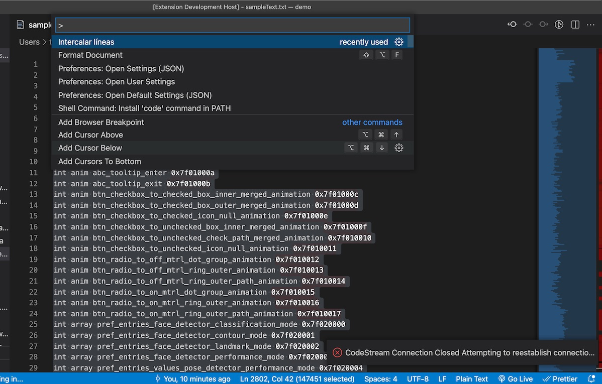
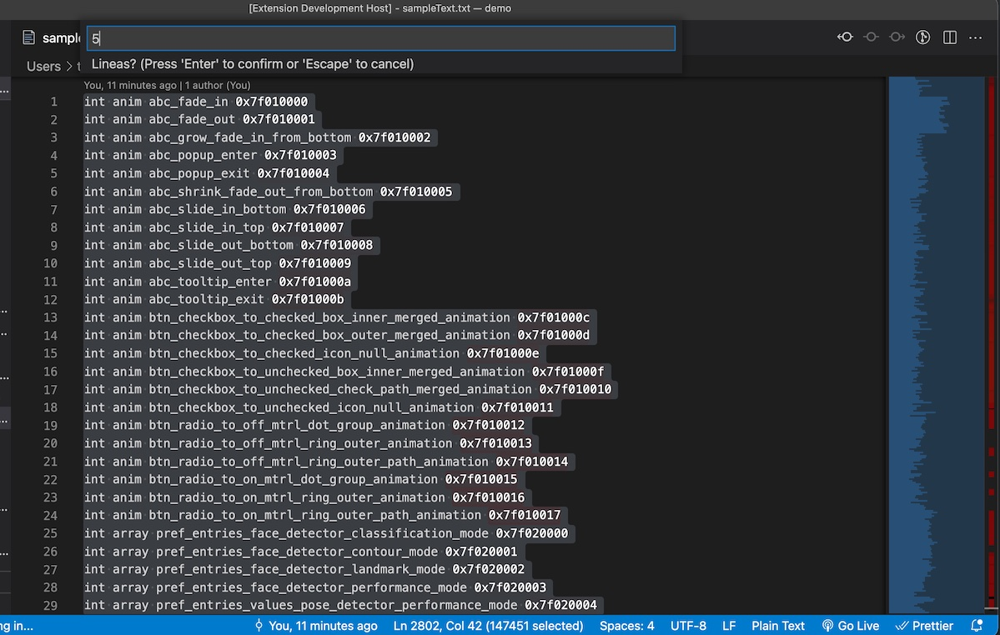
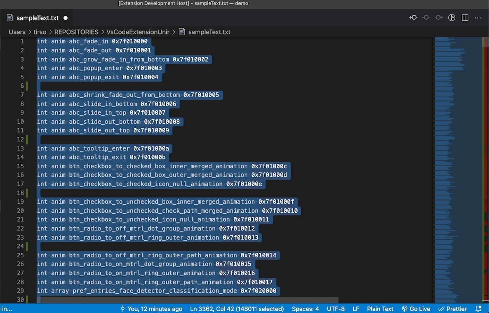

# VsCodeExtensionUnir
Actividad 1 para la materia de Computación en el cliente Web de la Maestría en Ingeniería de software y sistemas informáticos

Se requiere el uso de los paquetes yo, generator-code y typescript.
``` js
npm install -g yo generator-code typescript.
```

La extensión será compatible con VSCode >1.62

Para utilizar la función únicamente se requiere:
* Seleccionar el texto sobre el cual se llevara a cabo el intercalado de líneas

* Abrir la paleta de comandos y buscar el comando "Intercalar líneas"


* Ingresar el número de lineas entre las cuales se intercalará una línea en blanco


* El texto se ha modificado


